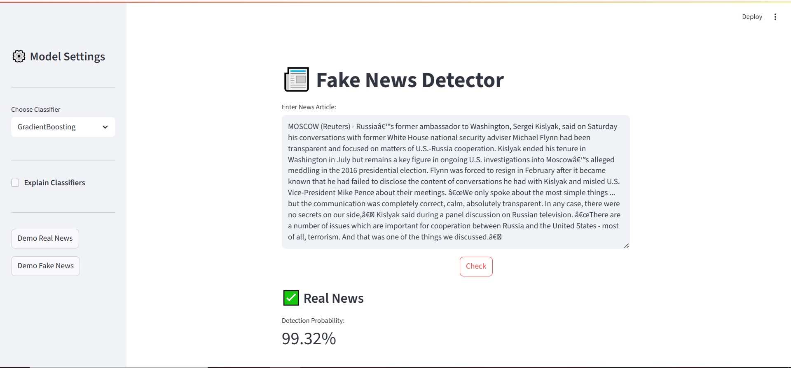

# Fake News Detection (NLP)

> End-to-end project to train a text classifier for fake/real news and run an app for interactive predictions.

## Problem Statement

With the rapid growth of online news and social media, the spread of fake news has become a major global issue. Fake news can mislead people, create panic, influence public opinion, and even impact elections or financial markets. Distinguishing between real news and fabricated information manually is challenging due to the sheer volume of content being published every second.

This project aims to build a machine learning–based Fake News Detection System that can automatically classify a given news article as real or fake. Using Natural Language Processing (NLP) techniques like text cleaning and TF-IDF vectorization, and applying machine learning classifiers such as Logistic Regression, Random Forest, Decision Trees, and Gradient Boosting, the system learns from labeled news datasets and achieves high accuracy in detecting misinformation.

##  Overview
This repository contains:
- **Datasets** (folder `Datasets/`) for training/evaluation.
- **Models PipeLine** (folder `models pipeline/`) Have 4 Trained Pipelined Models. 
- **NoteBook** (folder `NoteBook/`) for exploration and experiments.
- **Application** (`app.py`) to load the trained model and run an interactive UI or server for predictions.
- **Saved model** (`news_detector.joblib`) produced after training.
- **Dependencies** (`requirements.txt`).

## Model Performance 

We evaluated multiple models and **Gradient Boosting Classifier achieved the highest accuracy** among them.

### Accuracy (By model)
- **Gradient Boosting Classifier** — **99.52%**
- **Decision Tree Classifier** — **99.47%**
- **Logistic Regression** — **98.78%**
- **Random Forest Classifier** — **98.70%**

### Gradient Boosting Classifier 
From the classification report:
- **Accuracy:** **99.52%** (rounded from `.score`)
- **Macro Avg Precision:** **100.00%**
- **Macro Avg Recall:** **100.00%**
- **Macro Avg F1-Score:** **100.00%**
- **Weighted Avg Precision/Recall/F1:** **100.00%**

> Note: The classification report displays macro/weighted averages rounded to 1.00, which appear as 100.00%. The exact accuracy from `.score` is 99.52%.

---

### Result
**App Link :** ["News-Gaurd"](https://news-gaurd.streamlit.app/)


## 📁 Repository Structure

```text
Fake_News_Detection/
├─ Datasets/                 # Place/download datasets here (CSV/JSON, etc.)
├─ Model Pipelines           # Save Pipelines in Joblib
├─ Joblib models             # Saved Joblib Models
├─ NoteBook/                 # Jupyter notebooks for EDA/experiments
├─ app.py                    # App entrypoint (Streamlit/Flask UI)
├─ news_detector.joblib      # Trained sklearn model (serialized via joblib)
├─ requirements.txt          # Python dependencies
└─ README.md
```

##  Approach (Typical Pipeline)
1. **Ingest & Clean**: Load news text & labels (fake/real) from `Datasets/`.
2. **Preprocess**: Lowercase, strip punctuation, remove stopwords; optionally lemmatize.
3. **Vectorize**: `TF-IDF` or similar n-gram features.
4. **Model**: Train a linear classifier (**Logistic Regression**), or an ensemble ( **RandomForest**,**GradientBostingClassifier**), or Tree (**DecisionTreeClassifier**).
5. **Evaluate**: Accuracy, Precision/Recall/F1.
6. **Persist**: Save the trained pipeline to `news_detector.joblib`.
7. **Serve**: Load the model in `app.py` to provide predictions for new text.

##  Requirements
- Install Python 3.9+ and then:
- Install Required Libraries In Python (Mensioned in requirements.txt)

 ## Training

Make sure your dataset files are placed inside Datasets/ and that train.py points to the correct paths.
bash ``
python train.py
``
This will train the model and update/save news_detector.joblib in the repository root (or the path configured in train.py).

## Running the App

Streamlit UI
bash``
streamlit run app.py
``
Then open the URL shown in the terminal (usually http://localhost:8501/).

### Author
####      Omkar Waghmare.
